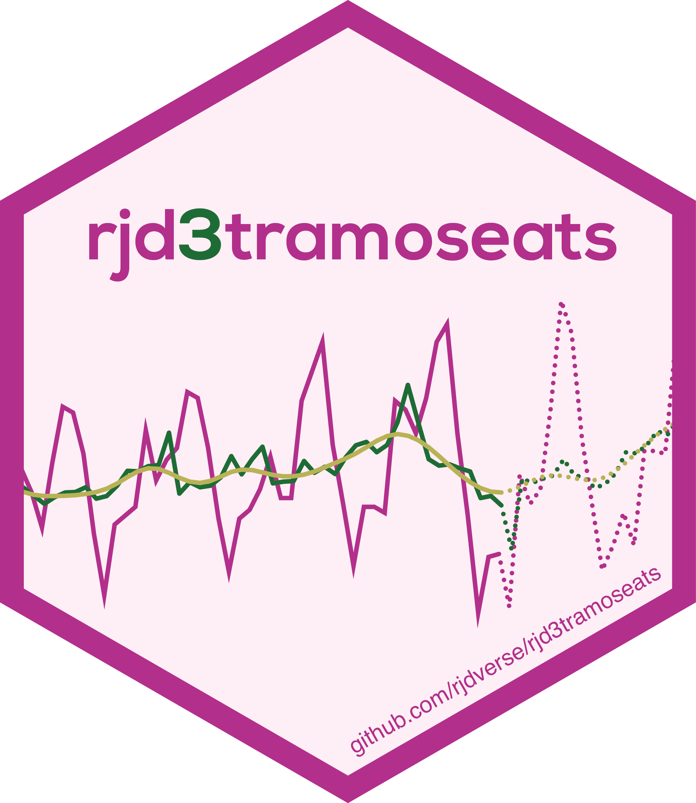

<!-- README.md is generated from README.Rmd. Please edit that file -->

# `rjd3tramoseats` <a href="https://rjdverse.github.io/rjd3tramoseats/"></a>

<!-- badges: start -->

[](https://CRAN.R-project.org/package=rjd3tramoseats)

[](https://github.com/rjdverse/rjd3tramoseats/actions/workflows/R-CMD-check.yaml)
[](https://github.com/rjdverse/rjd3tramoseats/actions/workflows/lint.yaml)

[](https://github.com/rjdverse/rjd3tramoseats/actions/workflows/pkgdown.yaml)
<!-- badges: end -->

rjd3tramoseats offers full access to options and outputs of TRAMO-SEATS
(`rjd3tramoseats::tramoseats()`), including TRAMO modelling
(`rjd3tramoseats::tramo()`) and SEATS decomposition
(`rjd3tramoseats::seats_decompose()`).

A specification can be created with `rjd3tramoseats::tramo_spec()` or
`rjd3tramoseats::tramoseats_spec()` and can be modified with the
following functions:

- for pre-processing: `rjd3toolkit::set_arima()`,
  `rjd3toolkit::set_automodel()`, `rjd3toolkit::set_basic()`,
  `rjd3toolkit::set_easter()`, `rjd3toolkit::set_estimate()`,
  `rjd3toolkit::set_outlier()`, `rjd3toolkit::set_tradingdays()`,
  `rjd3toolkit::set_transform()`, `rjd3toolkit::add_outlier()`,
  `rjd3toolkit::remove_outlier()`, `rjd3toolkit::add_ramp()`,
  `rjd3toolkit::remove_ramp()`, `rjd3toolkit::add_usrdefvar()`;

- for decomposition: `rjd3tramoseats::set_seats()`;

- for benchmarking: `rjd3toolkit::set_benchmarking()`.

## Installation

Running rjd3 packages requires **Java 17 or higher**. How to set up such
a configuration in R is explained
[here](https://jdemetra-new-documentation.netlify.app/#Rconfig)

To get the current stable version (from the latest release):

``` r
# install.packages("remotes")
remotes::install_github("rjdverse/rjd3toolkit@*release")
remotes::install_github("rjdverse/rjd3tramoseats@*release")
```

To get the current development version from GitHub:

``` r
# Install development version from GitHub
# install.packages("remotes")
remotes::install_github("rjdverse/rjd3tramoseats")
```

## Usage

``` r
library("rjd3tramoseats")
y <- rjd3toolkit::ABS$X0.2.09.10.M
ts_model <- tramoseats(y) 
summary(ts_model$result$preprocessing) # Summary of tramo model
#> Log-transformation: yes 
#> SARIMA model:  (0,1,1) (0,1,1)
#> 
#> Coefficients
#>           Estimate Std. Error  T-stat Pr(>|t|)    
#> theta(1)  -0.82783    0.02571 -32.196  < 2e-16 ***
#> btheta(1) -0.42554    0.06388  -6.661 9.01e-11 ***
#> ---
#> Signif. codes:  0 '***' 0.001 '**' 0.01 '*' 0.05 '.' 0.1 ' ' 1
#> 
#> Regression model:
#>                   Estimate Std. Error T-stat Pr(>|t|)    
#> monday          -0.0109446  0.0034805 -3.145 0.001788 ** 
#> tuesday          0.0048940  0.0035307  1.386 0.166479    
#> wednesday        0.0001761  0.0034970  0.050 0.959867    
#> thursday         0.0132928  0.0035330  3.763 0.000193 ***
#> friday          -0.0024801  0.0035383 -0.701 0.483747    
#> saturday         0.0153509  0.0035171  4.365 1.62e-05 ***
#> lp               0.0410667  0.0101178  4.059 5.93e-05 ***
#> easter           0.0503888  0.0072698  6.931 1.68e-11 ***
#> AO (2000-06-01)  0.1681662  0.0299743  5.610 3.78e-08 ***
#> AO (2000-07-01) -0.1972348  0.0298664 -6.604 1.28e-10 ***
#> ---
#> Signif. codes:  0 '***' 0.001 '**' 0.01 '*' 0.05 '.' 0.1 ' ' 1
#> Number of observations:  425 , Number of effective observations:  412 , Number of parameters:  13 
#> Loglikelihood:  781.358, Adjusted loglikelihood:  -2086.269
#> Standard error of the regression (ML estimate):  0.03615788 
#> AIC:  4198.538 , AICc:  4199.452 , BIC:  4250.811
```

``` r
plot(ts_model) # Plot of the final decomposition
```


To get the final components you can use the function
`rjd3toolkit::sa_decomposition()`:

``` r
rjd3toolkit::sa_decomposition(ts_model)
#> Last values
#>          series       sa    trend      seas       irr
#> Sep 2016 1393.5 1552.616 1561.206 0.8975174 0.9944979
#> Oct 2016 1497.4 1568.366 1559.217 0.9547514 1.0058681
#> Nov 2016 1684.3 1528.962 1557.382 1.1015974 0.9817508
#> Dec 2016 2850.4 1542.997 1556.132 1.8473143 0.9915588
#> Jan 2017 1428.5 1545.950 1555.502 0.9240275 0.9938587
#> Feb 2017 1092.4 1551.369 1555.210 0.7041521 0.9975303
#> Mar 2017 1370.3 1553.207 1555.087 0.8822391 0.9987913
#> Apr 2017 1522.6 1580.752 1554.759 0.9632123 1.0167187
#> May 2017 1452.4 1554.517 1553.908 0.9343093 1.0003924
#> Jun 2017 1557.2 1551.804 1552.778 1.0034774 0.9993726
#>  [ reached getOption("max.print") -- omitted 2 rows ]
```

## Package Maintenance and contributing

Any contribution is welcome and should be done through pull requests
and/or issues. pull requests should include **updated tests** and
**updated documentation**. If functionality is changed, docstrings
should be added or updated.

## Licensing

The code of this project is licensed under the [European Union Public
Licence
(EUPL)](https://joinup.ec.europa.eu/collection/eupl/eupl-text-eupl-12).
