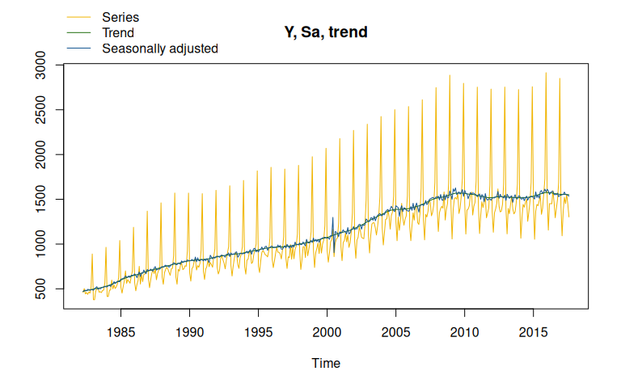

# {rjd3tramoseats}

[](https://github.com/rjdverse/rjd3tramoseats/actions/workflows/R-CMD-check.yaml)
[](https://github.com/rjdverse/rjd3tramoseats/actions/workflows/lint.yaml)

[](https://github.com/rjdverse/rjd3tramoseats/actions/workflows/pkgdown.yaml)

{rjd3tramoseats} offers full access to options and outputs of
TRAMO-SEATS
([`rjd3tramoseats::tramoseats()`](https://rjdverse.github.io/rjd3tramoseats/reference/tramoseats.md)),
including TRAMO modelling
([`rjd3tramoseats::tramo()`](https://rjdverse.github.io/rjd3tramoseats/reference/tramo.md))
and SEATS decomposition
([`rjd3tramoseats::seats_decompose()`](https://rjdverse.github.io/rjd3tramoseats/reference/seats_decompose.md)).

A specification can be created with
[`rjd3tramoseats::tramo_spec()`](https://rjdverse.github.io/rjd3tramoseats/reference/tramoseats_spec.md)
or
[`rjd3tramoseats::tramoseats_spec()`](https://rjdverse.github.io/rjd3tramoseats/reference/tramoseats_spec.md)
and modified with the following functions:

- for pre-processing: `rjd3tramoseats::set_arima()`,
  `rjd3tramoseats::set_automodel()`, `rjd3tramoseats::set_basic()`,
  `rjd3tramoseats::set_easter()`, `rjd3tramoseats::set_estimate()`,
  `rjd3tramoseats::set_outlier()`, `rjd3tramoseats::set_tradingdays()`,
  `rjd3tramoseats::set_transform()`, `rjd3tramoseats::add_outlier()`,
  `rjd3tramoseats::remove_outlier()`, `rjd3tramoseats::add_ramp()`,
  `rjd3tramoseats::remove_ramp()`, `rjd3tramoseats::add_usrdefvar()`;

- for decomposition:
  [`rjd3tramoseats::set_seats()`](https://rjdverse.github.io/rjd3tramoseats/reference/set_seats.md);

- for benchmarking:
  [`rjd3toolkit::set_benchmarking()`](https://rjdverse.github.io/rjd3toolkit/reference/set_benchmarking.html).

## Installation

Running rjd3 packages requires **Java 21 or higher**. How to set up such
a configuration in R is explained
[here](https://jdemetra-new-documentation.netlify.app/#Rconfig)

**🎉 {rjd3tramoseats} is now available on CRAN! 🎉**

To install it, just launch the following command line:

``` r
install.packages("rjd3tramoseats")
```

To get the current development version of **{rjd3tramoseats}** from
[GitHub](https://github.com/) with:

``` r
# install.packages("remotes")
remotes::install_github("rjdverse/rjd3tramoseats")
```

## Usage

### Seasonal Adjustment with Tramo-Seats

``` r
library("rjd3tramoseats")
y <- rjd3toolkit::ABS$X0.2.09.10.M
ts_model <- tramoseats(y)
summary(ts_model$result$preprocessing) # Summary of tramo model
#> Log-transformation: yes 
#> SARIMA model: (0,1,1) (0,1,1)
#> 
#> Coefficients
#>           Estimate Std. Error  T-stat Pr(>|t|)    
#> theta(1)  -0.82783    0.02571 -32.196  < 2e-16 ***
#> btheta(1) -0.42554    0.06388  -6.661 9.01e-11 ***
#> ---
#> Signif. codes:  0 '***' 0.001 '**' 0.01 '*' 0.05 '.' 0.1 ' ' 1
#> 
#> Regression model:
#>                   Estimate Std. Error T-stat Pr(>|t|)    
#> mon             -0.0109446  0.0034805 -3.145 0.001788 ** 
#> tue              0.0048940  0.0035307  1.386 0.166481    
#> wed              0.0001761  0.0034970  0.050 0.959867    
#> thu              0.0132928  0.0035330  3.763 0.000193 ***
#> fri             -0.0024801  0.0035383 -0.701 0.483748    
#> sat              0.0153509  0.0035171  4.365 1.62e-05 ***
#> lp               0.0410667  0.0101178  4.059 5.94e-05 ***
#> easter           0.0503888  0.0072698  6.931 1.69e-11 ***
#> AO (2000-06-01)  0.1681662  0.0299743  5.610 3.78e-08 ***
#> AO (2000-07-01) -0.1972348  0.0298664 -6.604 1.28e-10 ***
#> ---
#> Signif. codes:  0 '***' 0.001 '**' 0.01 '*' 0.05 '.' 0.1 ' ' 1
#> Number of observations: 425, Number of effective observations: 412, Number of parameters: 13
#> Loglikelihood: 781.358, Adjusted loglikelihood: -2086.269
#> Standard error of the regression (ML estimate): 0.03615788 
#> AIC: 4198.538, AICc: 4199.452, BIC: 4250.811
plot(ts_model) # Plot of the final decomposition
```



## Package Maintenance and contributing

Any contribution is welcome and should be done through pull requests
and/or issues. pull requests should include **updated tests** and
**updated documentation**. If functionality is changed, docstrings
should be added or updated.

## Licensing

The code of this project is licensed under the [European Union Public
Licence
(EUPL)](https://interoperable-europe.ec.europa.eu:443/collection/eupl/eupl-text-eupl-12).
